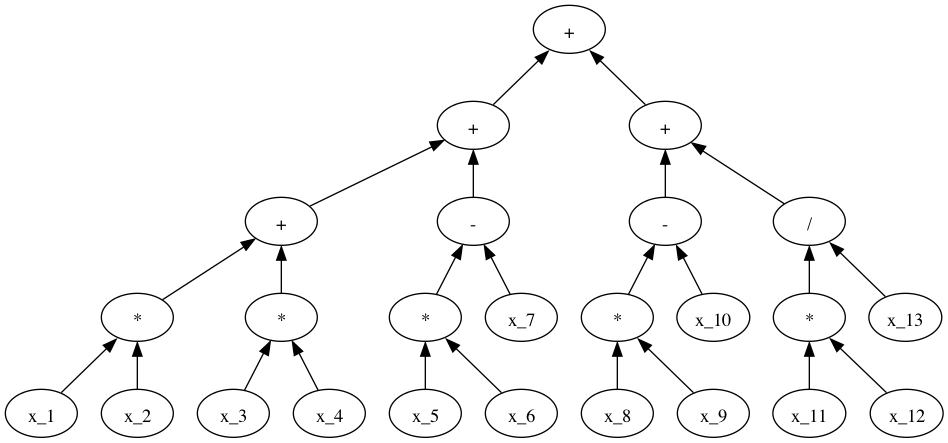

# Problem
Given a task (e.g., arithmetic reasoning) and a model, I want to know what *types* of problems in this task that the model finds difficult.

## Proposed solution, high-level
Generate samples from a structured representation of your task, and use this structured representation to *search* for the worst performing problems.

## Proposed solution
For now, I just consider GSM8k-style math word problems. I specify a set of valid math word problems with a context-free [grammar](https://github.com/AlexWan0/dynamic-eval/blob/6ff81f813662d822ae5b2996ee0eaf7216fe6af9/mwp/problems/problem_values.py#L53). This lets me generate problems with a specific structure. For example, I can convert the following arithmetic expression

<p align="center">
    
</p>

into the problem:
> Being a plumber pays $5 an hour. Tina worked 19 hours as a plumber. Being a nurse pays $2 an hour. David worked 49 hours as a nurse. A ball costs $96. The group bought a ball using the amount David made working as a nurse. The group pooled the amount Tina made working as a plumber and the amount of money left after buying a ball and put it in a silver piggy bank. **What is the value of the amount of money in the silver piggy bank?**

Using this structured representation, I then search through the space of problems using Thompson sampling. The latter was inspired by ([Sclar et al., 2023](https://arxiv.org/pdf/2310.11324)).

# Experiments
I search with a budget of 2500 queries (to `Claude v1.2 Instant`) over a space of arithmetic reasoning problems that have similar levels of complexity. 

## Analysis of hard problems
The worst performing problem has an accuracy of 67.5\% over 80 queries, and has the structure:

<p align="center">
    
</p>

Each query involves sampling random integers for `x_1, ..., x_12` such that all intermediate values are between 2 and 100, and sampling random values for names, items, jobs, etc. that are used in the story.

The (relatively) poor performance on this problem type isn't <i>just</i> due to its complexity as one of the best performing problems gets 100% accuracy over 40 queries, with the structure:

<p align="center">
    
</p>


# API
See `experiemnts/find_spread.py` for an example of usage. To generate problems, run:

```python
problem = ProblemBuilder("jobs")
df = problem.build_dataset(
    max_depth,
    num_samples_per_problem,
    min_depth=min_depth,
    subsample=num_subsample
)
```

where `jobs` is a problem specified in `mwp/problems/problem_values.py`.

To search for the best/worst problems, run:

```python
ps = ProblemSpace(df, replace=True)
opt = ThompsonOpt(ps, reward_func, beta_prior=(1, 1))
ranked_arms, arm_vals = opt.optimize(
    budget=budget,
    samples_per_pull=samples_per_pull,
    maximize=maximize,
    verbose=True
)
```

where `reward_func` is a black-box function that returns the accuracy given a batch of samples, and `samples_per_pull` specifies size of the batch (See [Sclar et al., 2023](https://arxiv.org/pdf/2310.11324) for more detail).
